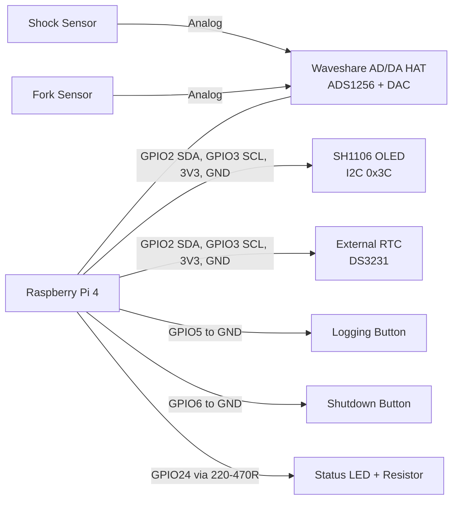

# System Schematic (Derived from Project)

This document summarizes the wiring derived from the current MTB telemetry project configuration and code.

## Scope

- Platform: Raspberry Pi 4
- ADC board: Waveshare High-Precision AD/DA HAT (ADS1256)
- Sensors: 2 analog travel sensors
  - Shock on AD0
  - Fork on AD1
- Controls and UI:
  - Logging button
  - Shutdown button
  - Status LED
  - SH1106 OLED over I2C
- Time base:
  - External RTC (DS3231 recommended in project docs)

## Overview Diagram

## Raspberry Pi Pin Mapping

| Function | BCM GPIO | Physical Pin | Connection |
|---|---:|---:|---|
| OLED SDA | 2 | 3 | SH1106 SDA |
| OLED SCL | 3 | 5 | SH1106 SCL |
| OLED VCC | - | 1 | 3V3 |
| OLED GND | - | 6 | GND |
| RTC SDA | 2 | 3 | External RTC SDA |
| RTC SCL | 3 | 5 | External RTC SCL |
| RTC VCC | - | 17 or 1 | 3V3 supply for a 3.3 V-compatible RTC module |
| RTC GND | - | 20 or 6 | GND |
| Logging button | 5 | 29 | Button to GND (active-low, internal pull-up) |
| Shutdown button | 6 | 31 | Button to GND (active-low, internal pull-up) |
| Status LED | 24 | 18 | GPIO24 -> 220-470 ohm -> LED anode, LED cathode -> GND |

## Waveshare HAT Reserved GPIOs

These GPIOs are reserved by the HAT and must not be reused for buttons/LED/etc.

| BCM GPIO | HAT Function |
|---:|---|
| 17 | ADS1256 DRDY |
| 18 | ADS1256 RESET |
| 22 | ADS1256 CS |
| 23 | DAC CS |
| 27 | ADS1256 PDWN/SYNC |

## Sensor Channel Assignment

- AD0: Shock travel sensor
- AD1: Fork travel sensor

Calibration files in project:
- calibration/haltech_ads1256_ad0.json
- calibration/haltech_ads1256_ad1.json

## Electrical Notes

- The project reads ADS1256 with a 5.0 V reference assumption for conversion.
- Sensor outputs are expected in a 0-5 V range for full travel mapping.
- The external RTC shares the same I2C bus as the OLED (GPIO2/GPIO3).
- All external controls (buttons, LED return) share common GND with Raspberry Pi.
- For the status LED, always use a series resistor (220-470 ohm).

## Default Runtime Wiring (Service)

From systemd defaults:
- CONTROL_MODE=button
- CONTROL_GPIO=5
- SHUTDOWN_GPIO=6
- STATUS_LED_GPIO=24
- OLED_ENABLE=1
- OLED_I2C_BUS=1
- OLED_I2C_ADDRESS=0x3C

## Quick Validation Checklist

1. Confirm HAT is seated correctly on Pi header.
2. Confirm logging button between GPIO5 and GND.
3. Confirm shutdown button between GPIO6 and GND.
4. Confirm status LED polarity and resistor on GPIO24.
5. Confirm OLED wiring on GPIO2/GPIO3 and I2C address 0x3C.
6. Confirm shock sensor signal is on AD0 and fork signal on AD1.

## Source Files Used

- docs/oled_wiring_and_status.md
- docs/python_commands.md
- deploy/systemd/mtb-telemetry-button.service
- scripts/haltech_two_point_mm.py
- src/mtb_telemetry/sensors/ads1256.py
